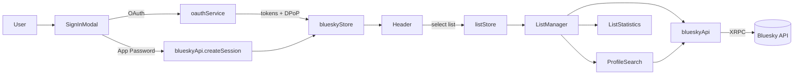

### Bluesky List Manager — Technical Design Spec

This document describes the current architecture, key modules, data and control flows, and important design decisions of the Bluesky List Manager app.

## Scope and Goals
- **Goal**: Provide a better UX for discovering profiles and managing members of Bluesky lists.
- **Tech**: Svelte 4 + Vite 5, TailwindCSS, client-side calls to Bluesky XRPC API.
- **Auth**: Dual-mode authentication — OAuth 2.0 with PKCE + DPoP (preferred) and App Passwords (legacy/fallback).

## High-Level Architecture
- **SPA** bundled by Vite, mounted in `index.html` → `src/main.js` → `src/App.svelte`.
- **State management** via Svelte stores:
  - `src/stores/blueskyStore.js`: session/auth type lifecycle.
  - `src/stores/listStore.js`: selected list, members, pagination, membership cache.
- **Services** encapsulate Bluesky API details:
  - `src/services/blueskyApi.js`: XRPC endpoints, auth headers, paging, CRUD list items.
  - `src/services/oauthService.js`: OAuth PKCE + DPoP flow (browser), token storage.
  - `src/services/oauthServiceProduction.js`: a production-optimized variant (no jose dep, manual signing).
- **UI composition** via Svelte components:
  - Core: `Header.svelte`, `AuthInstructions.svelte`, `SignInModal.svelte`, `ListSelector.svelte`, `ListManager.svelte`, `ProfileSearch.svelte`, `ListStatistics.svelte`, `LoadingOverlay.svelte`.
  - Visual helpers: `ButterflyBackground.svelte`, `BlueskyUserProfile.svelte`, `ZoomableImage.svelte`.
  - View orchestration in `App.svelte` based on auth and list selection.
- **Static assets/config**: `static/` (favicons, OG images), `src/config.js` for asset pathing across environments, `vite.config.js` and `vite.config.local.js` for base path and proxy.

## Boot and View Flow
- `index.html` mounts `#app`; `src/main.js` creates Svelte app targeting that element.
- `src/App.svelte`:
  - On mount calls `blueskyStore.initializeSession()` to restore OAuth or app password sessions from `localStorage`.
  - View routing is internal state: `auth` → `list-selector` → `manager` based on `$blueskyStore.session` and `$listStore.selectedList`.
  - Renders a `LoadingOverlay` while list data is loading.

## Authentication
- `src/components/SignInModal.svelte` offers two options:
  - OAuth (labelled as “Not working yet” in UI, but flow is implemented):
    - `startOAuthFlow()` constructs `authorize` URL with PKCE (code verifier/challenge), state, and environment-aware `redirect_uri`.
    - `oauth-callback.html` / `oauth-callback-standalone.html` call `handleOAuthCallback()` which:
      - Verifies state, exchanges code for tokens using DPoP.
      - Persists `accessToken`, `refreshToken`, `sub`, `serverNonce`, and DPoP keypair (as JWK) to `localStorage`.
  - App Password:
    - `blueskyApi.signIn(handle, password)` calls `com.atproto.server.createSession` and stores session in `blueskyStore`.
- `src/stores/blueskyStore.js` normalizes sessions and exposes:
  - `setSession(session, authType)`, `clearSession()`/`signOut()`, `initializeSession()`, `getSession()`, `isOAuthSession()`.
  - Storage keys: `bluesky_session`, `bluesky_auth_type` and OAuth storage under `bluesky_oauth_session`.
- `src/services/blueskyApi.js` builds auth headers for both modes:
  - App password: `Authorization: Bearer <accessJwt>`.
  - OAuth: `Authorization: Bearer <accessToken>` and `DPoP: <jwt>`; uses stored DPoP keypair and server nonce; per-request DPoP binding with optional `ath` hash.

## Bluesky API Integration
- Base: `https://bsky.social/xrpc`.
- Implemented endpoints in `blueskyApi`:
  - Auth: `com.atproto.server.createSession` (app password).
  - Lists: `app.bsky.graph.getLists?actor=...`, `app.bsky.graph.getList?list=...`.
  - Members: `app.bsky.graph.getList` for paged members (items + cursor); `com.atproto.repo.listRecords` to locate `listitem` records for delete.
  - Profiles: `app.bsky.actor.getProfile?actor=...` (single), `app.bsky.actor.searchActors?term=...` (paged search).
  - Mutations: `com.atproto.repo.createRecord` (add member), `com.atproto.repo.deleteRecord` (remove member) after finding `rkey` via `listRecords`.
  - Utilities: `com.atproto.identity.resolveHandle`.
- `makeBlueskyRequest(endpoint, session, authType, method, body)` centralizes request setup and error handling across both auth modes.

## State Management and Data Model
- `blueskyStore` state:
  - `session`: unified session object; `authType`: `'oauth' | 'app_password'`.
  - Loading and error flags for UI.
- `listStore` state:
  - `selectedList`: chosen list metadata; `userLists`: lists for current user.
  - `listMembers`: DIDs for the current page; `listMemberProfiles`: profiles for current page.
  - `isLoadingList`, `error`, `refreshTrigger`.
  - Methods: `setSelectedList()`, `setUserLists()`, `setListMembers()`, `setListMemberProfiles()`, `getAllListMemberDids()`, `isProfileInCurrentList()`, `isProfileInEntireList()`, `fetchAndAddProfile()` and helpers for loading flags and persistence.
  - Membership caching via `membershipCache` Map keyed by `listUri` and DID(s) to avoid repetitive network calls.

## UI Composition and Responsibilities
- `Header.svelte`
  - Shows sign-in state and user handle; opens `SignInModal`.
  - Fetches user lists post-auth using `blueskyApi.getUserLists(...)` and populates `listStore`.
  - Emits list changes to `listStore.setSelectedList()`.
- `ListManager.svelte`
  - Orchestrates list member loading and pagination (25/page default), stores cursors, updates counts.
  - Add/remove flows call `blueskyApi.addToList()` / `removeFromList()` and update local store immediately for responsive UX.
  - Composes `ListStatistics` and `ProfileSearch` side-by-side.
- `ProfileSearch.svelte`
  - Calls `blueskyApi.searchProfiles(...)` and checks list membership en masse via `listStore.getAllListMemberDids()` for fast “Already in list” tags.
  - Supports incremental paging via cursor; bulk add built around set of selected DIDs.
- `ListStatistics.svelte`
  - Computes basic stats immediately from current page; computes comprehensive stats by loading all members in batches (100/page) and analyzing profiles (avatars, bios, domains, etc.).
- `AuthInstructions.svelte`, `ListSelector.svelte`, `LoadingOverlay.svelte` support auth, selection, and global loading.

## Pagination and Performance Strategy
- Members: `getListMembers(..., limit, cursor)` uses Bluesky paging cursors and returns both DIDs and profile objects for the page.
- Profile rendering prefers profiles returned with `getListMembers` to avoid extra per-DID lookups.
- Membership checks favor a single full-list pass via `getAllListMemberDids()` over N× per-profile checks.
- UI updates are optimistic for add/remove, with store updates that adjust counts and lists without full reload.

## Error Handling
- Service-level: throws with API error messages; callers `try/catch` to set error UI states.
- Component-level: error strings displayed in contextual panels with retry buttons (`ListManager`, `ProfileSearch`).
- Defensive parsing around Bluesky response shapes; fallbacks when profiles fail to load.

## Security Considerations
- OAuth uses PKCE and DPoP; anti-CSRF `state` is enforced.
- Tokens and DPoP keypairs are stored in `localStorage`. Consider hardening to session storage or encrypted storage for sensitive contexts.
- No secrets or server components are required for core flows; all calls made directly to Bluesky.

## Configuration and Environments
- `vite.config.js` sets `base` to `./` in production to support subfolder hosting; `publicDir: 'static'`.
- `vite.config.local.js` adds a dev proxy under `/api` if a local helper backend is used.
- `src/config.js` exposes `getAssetPath()` to produce correct asset URLs across environments and subpaths.

## Known Legacy Artifacts
- `app.js` is a legacy vanilla JS implementation retained for reference. The Svelte app supersedes it.
- Previous Docker references have been removed; the project favors manual/static hosting now.

## Build and Deployment
- Dev: `npm run dev` or `npm run dev:local`.
- Build: `npm run build` generates `dist/` with `base: './'` for static hosting (subdirectory-friendly).
- Static hosting: serve `index.html` with assets from `static/` and built bundle from `dist/`.

## Extensibility Guidelines
- Add new Bluesky features by extending `blueskyApi` for endpoint calls and wiring to stores.
- Prefer store-driven state; components should react to store updates.
- For heavy computations (e.g., stats), batch API calls and compute incrementally with progress feedback.

## Future Enhancements
- Finalize OAuth UX (remove “Not working yet” text once fully verified across environments).
- Batch profile fetch API (if/when available) to optimize full-list stats passes.
- Virtualized list rendering for very large lists.
- Persist and sync list changes with minimal revalidation.
- Add unit tests for stores and services; smoke/e2e tests for core flows.

## File Inventory (Selected)
- Entry and shell:
  - `index.html`, `src/main.js`, `src/App.svelte`.
- Stores:
  - `src/stores/blueskyStore.js`, `src/stores/listStore.js`.
- Services:
  - `src/services/blueskyApi.js`, `src/services/oauthService.js`, `src/services/oauthServiceProduction.js`.
- Components:
  - `src/components/Header.svelte`, `AuthInstructions.svelte`, `SignInModal.svelte`, `ListSelector.svelte`, `ListManager.svelte`, `ProfileSearch.svelte`, `ListStatistics.svelte`, `LoadingOverlay.svelte`, `BlueskyUserProfile.svelte`, `ButterflyBackground.svelte`.
- Config/Build:
  - `src/config.js`, `vite.config.js`, `vite.config.local.js`, `postcss.config.js`, `tailwind.config.js`.

## Non-Functional Considerations
- Accessibility: semantic HTML, keyboard shortcuts in modal, alt text for avatars; further auditing recommended.
- Internationalization: current strings are hardcoded English; extract for i18n as needed.
- Telemetry/analytics: minimal (counter.dev script in `index.html`). Review for privacy compliance.
